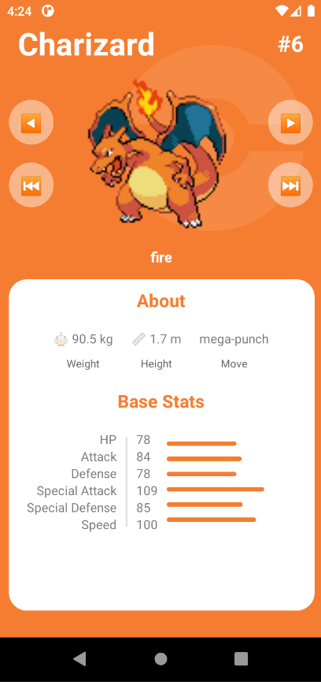
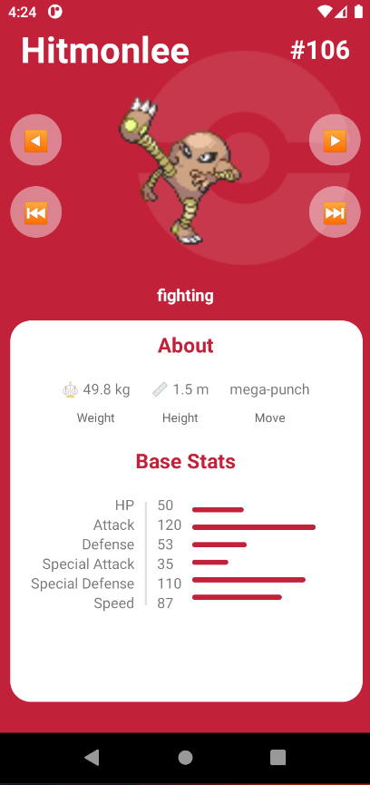
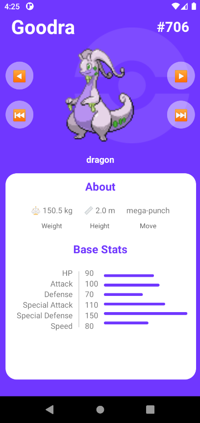

# Redux Pokedex Native

Exemplo de uso do redux no react native em um pokedex, do canal no youtube BetoMoedano - React Native Pokedex | Tutorial para principiantes.

#### tecnologias usadas:

- typescript
- react-redux
- @reduxjs/toolkit

---

## Screenshot

  
  
  

---
